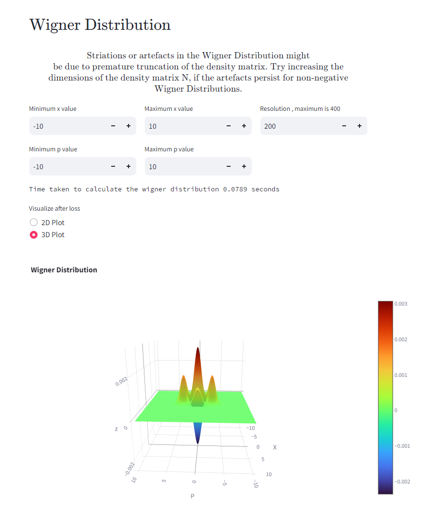
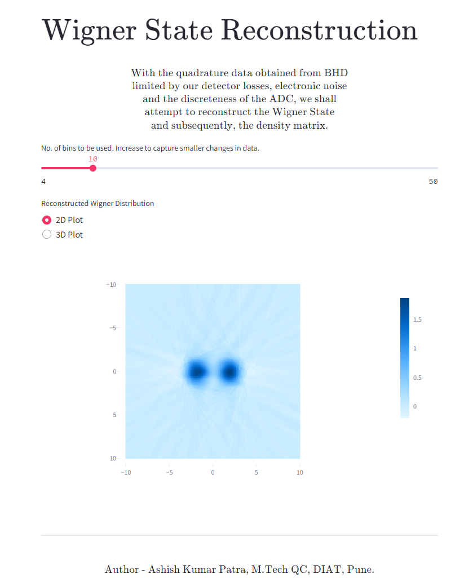

# homodyne_detection
Code to simulate Homodyne Detection.

- Code which can be used to simulate Balanced Homodyne Detection (realistically with losses and discretization due to detector ADC), on a set of quantum states, and the reconstruction of the Wigner Quasiprobability Distribution.
- Work in progress, currently working on adding Maximum Likelihood Estimation for Density Matrix Reconstruction.
- A streamlit application for the same (https://simulate-homodyne-data.streamlit.app/).
- One can simulate different quantum states here, and also download the simulated homodyne data for different states as a csv file for vvisualization or reconstruction purposes.

